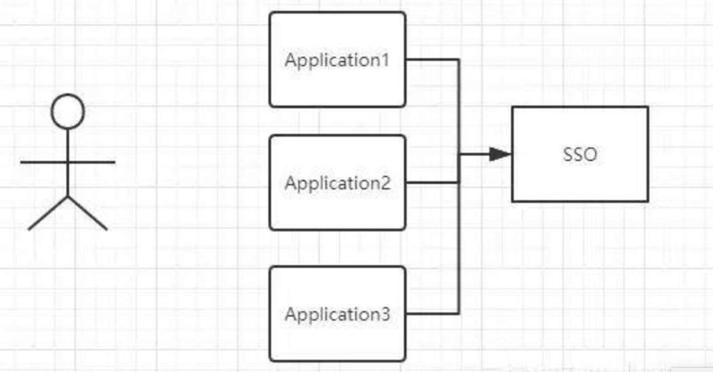

# 单点登录

## 场景

当用户登录 A 系统，会跳转到登录平台，登录成功后，访问系统 B 系统，此时会自动登录，不需要再次输入用户名密码。

## 什么是单点登录

单点登录（Single Sign On，SSO）是一种安全的登录方法，它允许用户使用一个账号登录多个网站。


## 单点登录实现方式

### 1.同域 SSO

所有系统在相同域名下，通过不同路径区分。
`damin: a.example.com,token:123`

```
http://a.example.com/app1
http://a.example.com/app2
http://a.example.com/app3
```

### 2.同父域 SSO

域名不一样，但是父域名一样。
`damin: example.com,token:123`

```
http://a1.example.com
http://a2.example.com
http://a3.example.com
```

### 3.跨域 SSO

集中式认证服务（Central Authentication Service，CAS），业界常用的单点登录解决方案。

#### 执行顺序

- 用户第一次访问
- 后端服务检查是否已经登录，没有登录返回 CAS 服务的登录页地址，且参数带上用户访问的页面地址
- 前端收到服务端响应跳转到 CAS 服务登录页
- CAS 服务端发现浏览器之前没建立过登录会话，跳转到 CAS 登录页面
- 用户填写用户名密码登录
- CAS 服务端验证登录信息成功，创建 Session 及颁发通行证，将 sessionid 和通行证通过响应头返回给浏览器
- 浏览器带着 sessionid 和通行证请求后端服务
- 后端服务带着通行证向 CAS 服务索要用户信息
- CAS 服务端验证后端服务的通行证是否有效，通过 XML 形式返回用户信息给后端服务
- 后端服务将用户信息存入 Session，返回用户访问的页面地址，并把 token 作为 cookie 返回给浏览器
- 后端服务后续根据 token 的有效性进行数据传输

### 4.授权协议 OAtH2.0

第三方平台授权，微信、微博、QQ、github
