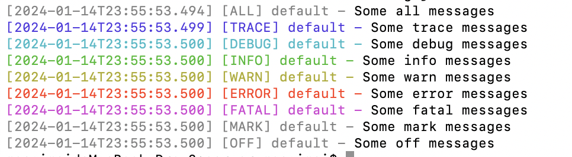

# 日志处理

## 日志分类

### access 日志

记录请求。

### error 日志

记录错误。业务抛出的异常等。

### application 日志

记录应用运行时的调试信息。

## log4js

```js
const log4js = require("log4js");
const logger = log4js.getLogger();
//在控制台输出调试日志
logger.level = "debug";
logger.debug("Some debug messages");
```

### 日志级别

由低到高：

- all
- trace
- debug
- info
- warn
- error
- fatal
- mark
- off

```js
const log4js = require("log4js");
const logger = log4js.getLogger();
logger.level = "all";
logger.all("Some all messages");

logger.level = "trace";
logger.trace("Some trace messages");

logger.level = "debug";
logger.debug("Some debug messages");

logger.level = "info";
logger.info("Some info messages");

logger.level = "warn";
logger.warn("Some warn messages");

logger.level = "error";
logger.error("Some error messages");

logger.level = "fatal";
logger.fatal("Some fatal messages");

logger.level = "mark";
logger.mark("Some mark messages");

logger.level = "off";
logger.off("Some off messages");
```



### 日志分类

getLogger()方法可以传入一个分类名称，用于区分不同的日志输出。

```js
const log4js = require("log4js");
const logger = log4js.getLogger();

/**
 * 在logs目录下，会生成app1.log和app2.log文件
 */
log4js.configure({
  appenders: {
    out: { type: "stdout" },
    app1: { type: "file", filename: "logs/app1.log" },
    app2: { type: "file", filename: "logs/app2.log" },
  },
  replaceConsole: true,
  categories: {
    default: { appenders: ["out"], level: "trace" },
    app1: { appenders: ["app1"], level: "trace" },
    app2: { appenders: ["app2"], level: "info" },
  },
});

logger.trace("This will use default category and go to stdout");

const app1Log = log4js.getLogger("app1");
app1Log.trace("This will go to a file");

const appLog2 = log4js.getLogger("app2");
appLog2.info("This will go to a file");
```

### 日志分割

可以根据日期、类别进行分割，防止日志文件过大，缩小日志查找范围

```js
/** 日志分割-按日期 */
log4js.configure({
  //在logs目录下生成app.yyyy-MM-dd-hh.log文件
  appenders: {
    app: {
      type: "dateFile",
      filename: "logs/app",
      pattern: "yyyy-MM-dd-hh.log",
      alwaysIncludePattern: true,
    },
  },
  categories: {
    default: { appenders: ["app"], level: "trace" },
    app: { appenders: ["app"], level: "trace" },
  },
});

const appLog = log4js.getLogger("app");
appLog.trace("This will go to a file");
```
